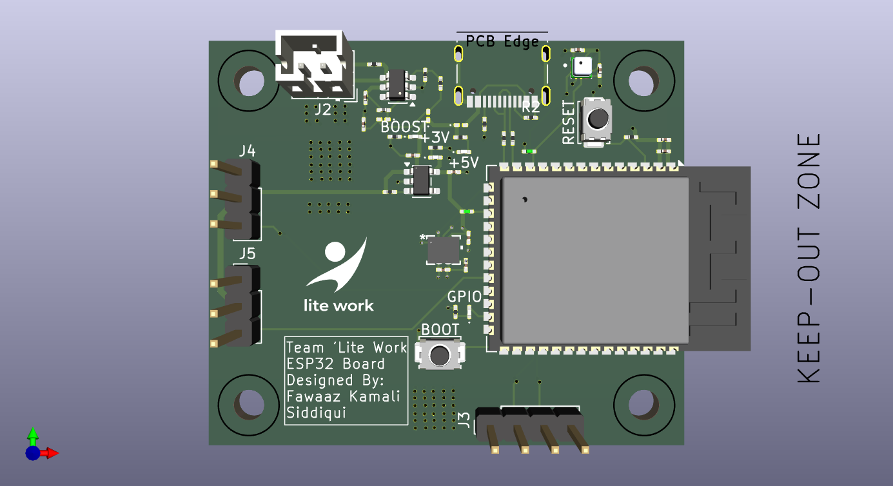
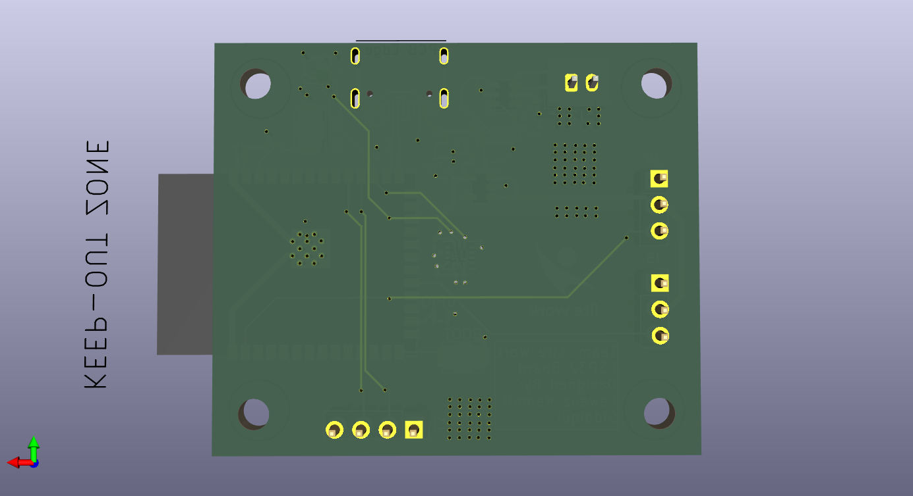
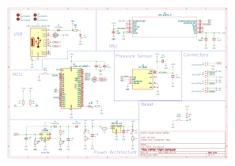
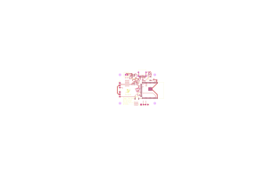
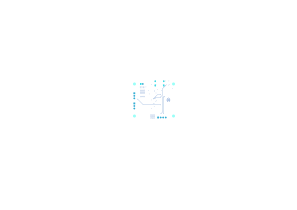

# CANSAT-LiteWork-2026
Repository containing major program files and schematics for Team 'Lite Work for the TMU CANSAT STEC Initiative 

Team Members: Fawaaz Kamali Siddiqui, Ben Reboks, Basim Allawala, Hamid Karimi

## ESP32 Flight Computer

### Overview

The flight computer designed in the PDR phase of the competition is simply named the ESP32 Flight Computer. The circuit was designed 
entirely in KiCad and the microcontroller for the circuit is the ESP32-S3-WROOM-1. 

The parts list for this circuit is as follows:

| Model | Description |
|---|---|
| ESP32-S3-WROOM-1 | Microcontroller Unit |
| ICM-42670-L | Inertial Measurement Unit |
| ICP-20100 | Barometric Pressure Sensor |
| NEO-6M Breakout Board | GPS Module |
| 2 x SG90 | Servo Motors |
| 1S 18605 LiFePO4 | Battery |

#### KiCad Files

  

    
    
    
<em>3D Render</em>

  

   

  

     
    
<em>Schematic</em>

  

   
  
  

    
     
    <em>Footprint</em>
  

